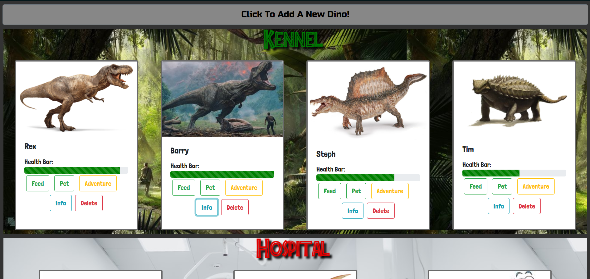
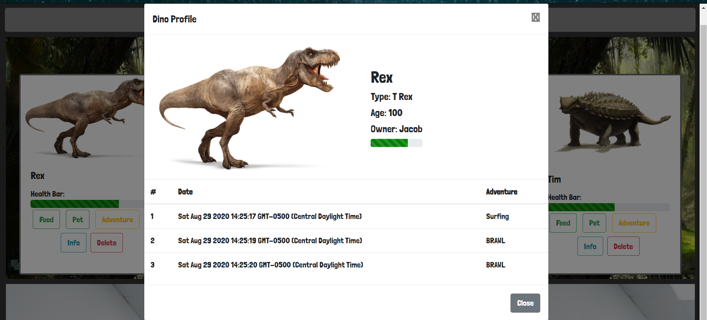

# Dino Kennel - NSS Milestone 1
This was built as a milestone project at NSS

#### Requirements:
* Healthy dinos show in the kennel
* Sick dinos show in the hospital
* Dead dinos show in the graveyard
* Dinos can be removed from the kennel
* Dinos can be added to the kennel
* Dinos can be fed
* Dinos can be pet
* Dinos can be sent on an adventure

### Motivation
This was to showcase and test our skills with what we have learned so far at NSS. We had no help from our teammates and really tested our individual skills and incorporated what skills we have learned. It helped challenge our skills to see what we needed to continue working on and gaining a better knowledge of.

### Build Status

### Screenshots

### Tech Used
* JavaScript ES6
* JQuery 3.5.1

### Site Link
[Dino Kennel Site](https://dinokenneljm.netlify.app/)
